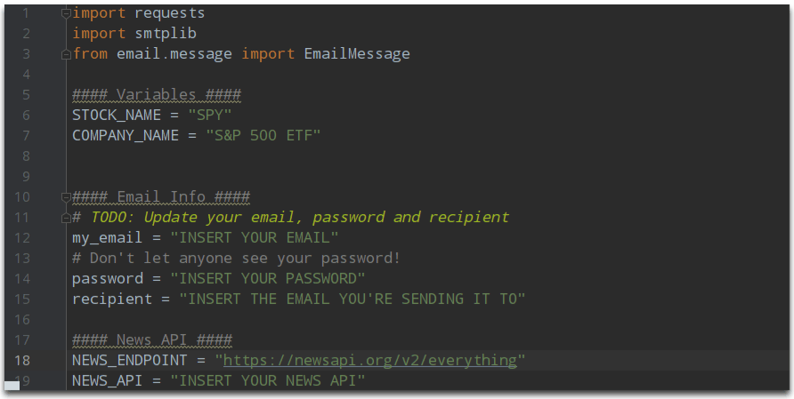

# Stock Monitoring Project 💸
Python code that analyses how stocks behave and gain insights about why they went up or down! 📈

## What does the code do? 🤯
The code will email you with the most important news about the company if a stock of your choice reduced or increased its price by 3%

## Concepts Applied 🧐:
- [x] API Management 🎨
  
- [x] Lists comprehension 🤓

- [x] Handling Errors

- [x] Email Sending

## Code Sneak Peek 😏
